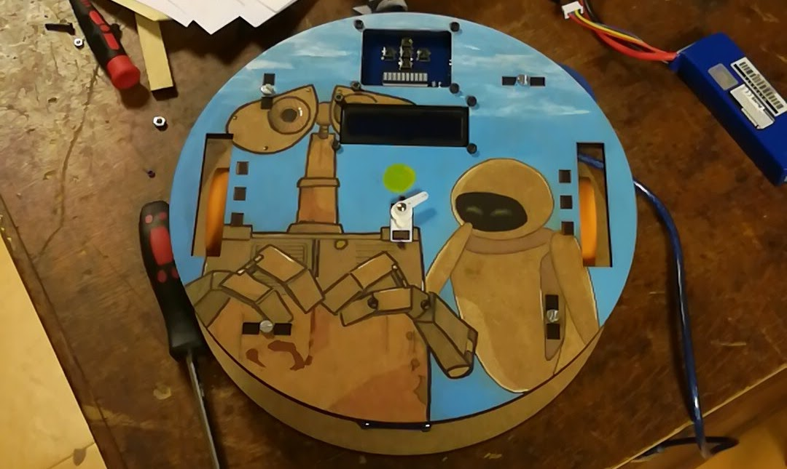

# KBOT V2.0

Un KBOT est un petit "robot sandwich" doté de deux roues motrices (moteurs+codeurs), d'une Arduino Méga 2560, d'un écran LCD 16x2, d'une batterie 3S… C'est une fabrication maison que réalise les premières années du club de robotique de l'ENS Paris-Saclay pour acquérir les bases de la robotique & se familiariser avec la programmation à travers l'IDE Arduino.
Pour plus d'information consultez notre site [[Kro]bot](https://wiki.crans.org/ClubKrobot).

Informations générales :
* *Mode de déplacement du robot :* entraînement différenciel
* *Moyens de communication :* USB, Bluetooth
* *Version actuelle :* 2.0 (Révisé par O. Leveque & Y. Labbe)

Ports I/O :
* 1 module Bluetooth (HC-06) ;
* 1 port SHARP ;
* 1 port Servo ;
* 1 port pour controler le niveau de charge de la batterie ;
* 1 Buzzer ;
* 1 port extension pour 5 Boutons ;
* 1 port extension pour 10 Leds.

Changements à venir pour la version 2.1 :
* CAO -> simplifier les entretoises des roues + ajuster l'empreinte de l'écran LCD
* PCB -> corriger l'agencement buzzer/bluetooth + corriger les couleurs des fils des encoders + changer le sens de la nappe PowerDistributor-PropulsionShield + changer sens connecteur batterie
